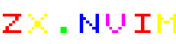

# zx.nvim



A simple Neovim plugin for building and running ZX Spectrum programs from Neovim.

The plugin is primarily designed for GNU/Linux and should also work on macOS out of the box.

## Installation

### The most minial setup lazy.nvim

```lua
{
    "dknight/zx.nvim",
    opts = {}, -- required
}
```

### Extended setup

Basic configuration. Here, `fbzx` is used as the emulator, but you can choose any emulator you prefer.

```lua
{
  "dknight/zx.nvim",
  name = "zx.nvim",

  opts = {
    emulator = "fbzx",
    basic_compiler = "zmakebas",
    assembler = "sjasmplus",
  },

  -- Optional: LuaSnip support
  dependencies = {
    "L3MON4D3/LuaSnip",
  },
}
```

## Commands

- `:ZXBuild` - build a TAP file
- `:ZXRun` - build and run
- `:ZXClean` - remove `*.tap` and `*.tzx` files
- `:ZXRenumber` - renumber BASIC lines

## Keymaps

Default key bindings:

- `<leader>b` - build
- `<leader>r` - run
- `<leader>x` - clean
- `<leader>n` - renumber BASIC lines
- `<leader>c` - comment line using BASIC REM statement, keeps line number.

You can also define your own key bindings in the plugin configuration:

```lua
{
  "dknight/zx.nvim",
  name = "zx.nvim",

  opts = {
    -- ...
    build_key = "<F9>",
    run_key = "<F10>",
  },
}
```

## Configuration (Optional)

All configuration options can be overridden during plugin initialization.

```lua
{
  "dknight/zx.nvim",
  name = "zx.nvim",

  -- Optional: LuaSnip support
  dependencies = {
    "L3MON4D3/LuaSnip",
  },

  opts = {
    save_before_compile = true,
    auto_renumber = true,

    emulator = "fbzx",
    window_name = "FBZX",

    basic_compiler = "zmakebas",
    assembler = "sjasmplus",

    build_key = "<leader>b",
    run_key = "<leader>r",
    clean_key = "<leader>x",
    renumber_key = "<leader>n",
  },
}
```
